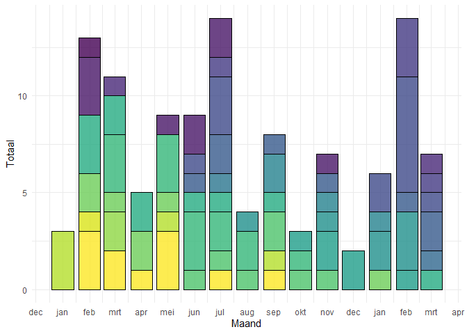
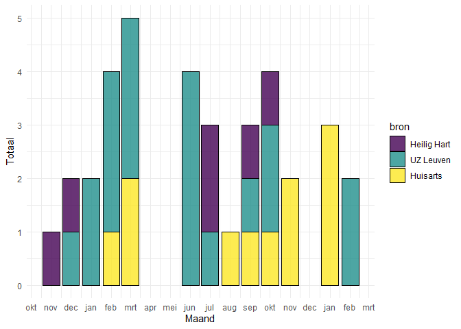

Evaluatie zorgprogramma hartfalen
================
Willem Raat
2021-04-27

# Inleiding

In dit rapport vindt u een kort overzicht van de interventies van het
Leuvense zorgprogramma hartfalen en van uw eigen implementatieproces.

# NT-proBNP

## Algemeen

Tussen januari 2020 en april 2021 werden er 115 NT-proBNP testen
afgenomen. Het maandgemiddelde was 8 testen. Onderstaande grafiek geeft
een overzicht van het aantal testen per deelnemende praktijk.

<!-- -->

# Educaties

## Algemeen

Tussen januari 2020 en april 2021 werden er 39 educaties uitgevoerd. Het
maandgemiddelde was 3 educaties. Onderstaande grafiek geeft een
overzicht van het aantal educaties per deelnemende praktijk.

<!-- -->
